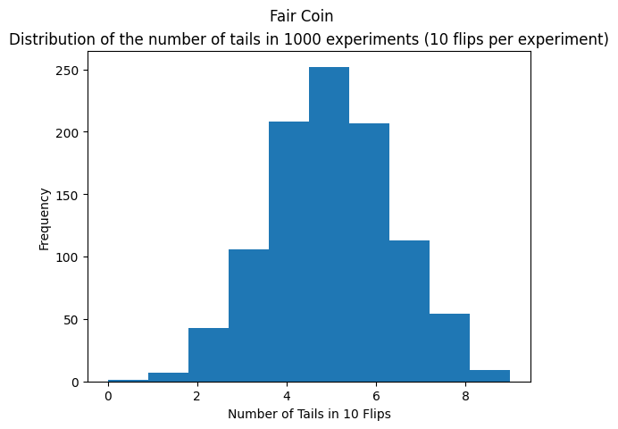
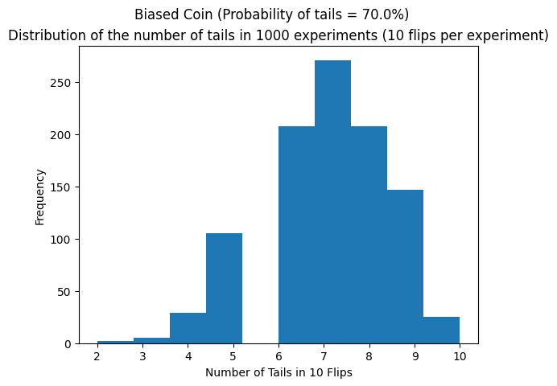

# Coin Flip Simulation & Analysis

## Table of Contents

- [Repository Structure](#repository-structure)
- [Description](#description)
- [Analysis Objectives](#analysis-objectives)
- [Installation](#installation)
- [Usage](#usage)
- [Key Insights](#key-insights)
- [Conclusions](#conclusions)
- [Contact](#contact)

## Repository Structure
```
coin_flip_simulation_and_analysis/  ├── README.md 
                                    ├── coin_flip_simulation_and_analysis.ipynb # Your Jupyter Notebook file 
                                    ├── coin_flip_simulation_and_analysis # separate script 
                                    └── images/ # Directory for plots and figures │ 
                                        ├── histogram_fair_coin.png │ 
                                        ├── proportion_fair_coin.png │ 
                                        ├── histogram_biased_coin.png │ 
                                        └── proportion_biased_coin.png 
                                         
```

## Description
This project explores fundamental probability and statistical concepts through the simulation and analysis of coin flips using Python, specifically leveraging the `numpy` and `matplotlib` libraries. The project demonstrates how simulations can be used to understand theoretical probability distributions and the Law of Large Numbers.

This notebook contains two basic, yet similar, coin flip simulations. The first simulation has two user-defined parameters: flips_per_experiment, which sets the number of coin flips in each experiment, and amount_of_experiments, which determines how many times this experiment is repeated. For each experiment run, the total number of tails is stored in the final_tails list. The final result is a list that records the number of tails for each experiment run. Users can adjust these parameters (flips_per_experiment or/and amount_of_experiments) to observe how the distribution changes with the total number of flips.
The second simulation also models coin flips, but this time with a large, continuous sequence of flips rather than divided experiments. The purpose of this is to observe how the proportion of tails approaches the expected theoretical distribution as the number of flips increases (demonstrating the Law of Large Numbers). 
Finally, both simulations are proposed again but with a biased coin. This demonstrates how the distribution changes when the coin is biased and the theoretical probability is different.

## Analysis Objectives
The main objectives of this analysis are:
- To simulate coin flips for both fair and biased coins.
- To analyze the distribution of outcomes (number of tails/heads) over multiple experiments.
- To visualize how the observed proportion of tails (or heads) converges towards the theoretical probability as the number of flips increases.
- To demonstrate proficiency in using Python for data simulation, analysis, and visualization.
- To illustrate basic statistical concepts such as distribution and expected value through simulation.

## Installation
To run this notebook or script locally, you will need Python installed. It is recommended to use a virtual environment.

1.  Clone the repository:
    ```bash
    git clone https://github.com/josearevalobezic/coin_flip_simulation_and_analysis.git
    cd coin_flip_simulation_and_analysis
    ```
2.  Install the required libraries. If you have a `requirements.txt` file, you can do this with pip:
    ```bash
    pip install -r requirements.txt
    ```
    Otherwise, install `numpy` and `matplotlib` manually:
    ```bash
    pip install numpy matplotlib
    ```

## Usage
You can interact with the analysis in two ways:

1.  **Using the Jupyter Notebook:** Open the `coin_flip_simulation_and_analysis.ipynb` file in a Jupyter environment (like JupyterLab, Jupyter Notebook, or Google Colab). You can run the cells sequentially to see the simulations and visualizations.
2.  **Running the Python Script (if created):** Execute the `coin_flip_simulation_and_analysis.py` file from your terminal:
    ```bash
    python coin_flip_simulation_and_analysis.py
    ```
    This will run the simulations and display or save the generated plots.

Feel free to modify the parameters within the notebook or script (e.g., number of flips, probability of tails) to explore different scenarios.

## Key Insights
*   **Distribution of Outcomes:** The histograms show that the distribution of the number of tails in a fixed number of flips tends to follow a binomial distribution, centering around the expected number of tails (number of flips * probability of tails).



*   **Law of Large Numbers:** The plots showing the proportion of tails over the number of flips demonstrate how the observed proportion fluctuates initially but converges towards the theoretical probability (0.5 for a fair coin, or the set probability for a biased coin) as the number of flips increases.


*   **Impact of Bias:** Simulating a biased coin clearly shifts the distribution of outcomes and the convergence point of the proportion of tails towards the higher probability outcome.

 


## Conclusions
This project successfully demonstrates the use of Python, NumPy, and Matplotlib to simulate coin flips and visualize fundamental statistical principles. The simulations provide empirical evidence for the expected outcomes of random events and illustrate the powerful concept of the Law of Large Numbers, showing how observed frequencies stabilize around theoretical probabilities over many trials. This analysis serves as a foundational example of how computational tools can be applied to understand probabilistic phenomena.


## Contact
[José Arévalo Bezic] - [jarevalobezic@gmail.com] - [https://github.com/josearevalobezic] - [www.linkedin.com/in/jarevalo-bezic]
